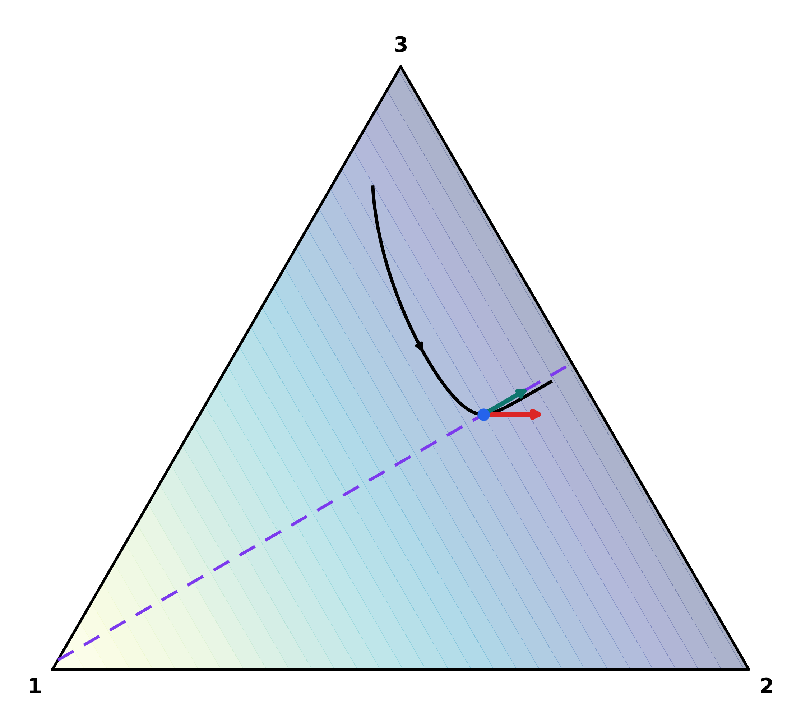

# Spectral requirements for cooperation

## Overview

This code reproduces Figure 1 from the paper "Spectral requirements for cooperation" by Lior Pachter, which illustrates the geometry of weak selection in frequency space for a structured population of 3 types. The example appears in the Existence section of the paper as a concrete instance of Theorem 3, and the figure provides a visual demonstration of what the spectral cooperation condition $\lambda_{\max} b > c$ means geometrically.

## The model

The population consists of 3 types with uniform neutral stationary distribution

$$\boldsymbol{\pi} = (1/3,\ 1/3,\ 1/3)^\top$$

Interactions between types are encoded by the operator $G$:

<table>
<tr><td>0.90</td><td>0.05</td><td>0.05</td></tr>
<tr><td>0.05</td><td>0.55</td><td>0.40</td></tr>
<tr><td>0.05</td><td>0.40</td><td>0.55</td></tr>
</table>

$G$ is symmetric and row-stochastic, so it is self-adjoint in the $\boldsymbol{\pi}$-weighted inner product and satisfies $G\mathbf{1} = \mathbf{1}$. The entry $G_{ij}$ gives the weight that type $i$ places on type $j$ when assessing its social environment.

## Spectral structure

The eigenvalues of $G$ are:

| Eigenvalue | Eigenvector | Interpretation |
|---|---|---|
| 1 | (1, 1, 1) | Neutral mode, eliminated by centering |
| 0.85 | (-2, 1, 1) | Leading cooperative mode |
| 0.15 | (0, 1, -1) | Subordinate cooperative mode |

The leading centered eigenvalue $\lambda_{\max} = 0.85$ governs the cooperation condition. For a donation game with benefit $b$ and cost $c$, cooperation can increase if and only if

$$\lambda_{\max}\, b  >   c \qquad \text{i.e.,} \qquad 0.85\, b  >  c$$

The leading cooperative mode $(-2, 1, 1)^\top$ represents a contrast in which type 1 defects while types 2 and 3 cooperate. The figure illustrates how replicator dynamics on the simplex $\Delta^2$ project onto this cooperative axis.

## What the figure shows

  

The simplex $\Delta^2$ is the state space of type frequencies $\mathbf{q} = (q_1, q_2, q_3)$ with $q_1 + q_2 + q_3 = 1$. The figure shows:

- A trajectory $\mathbf{q}(t)$ generated by the replicator equation with the interaction operator $G$, benefit $b = 1.35$, and cost $c = 1$
- The instantaneous Price direction $\dot{\mathbf{q}}(t_0)$ at a representative point
- Background shading indicating the cooperative mode identified by the leading eigenvector $\mathbf{u} \propto (-2, 1, 1)^\top$
- The projection of the Price direction onto this cooperative axis

These parameters satisfy $0.85 \times 1.35 = 1.1475 > 1$, so the leading cooperative mode is favored by selection. The subordinate mode with eigenvalue $0.15$ is not favored, since $0.15 \times 1.35 = 0.2025 < 1$. The teal arrow is therefore pointing in the direction of increasing cooperation, and its length relative to the full Price direction (red arrow) shows how much of the current evolutionary motion is aligned with the cooperative axis identified by the spectral condition.
